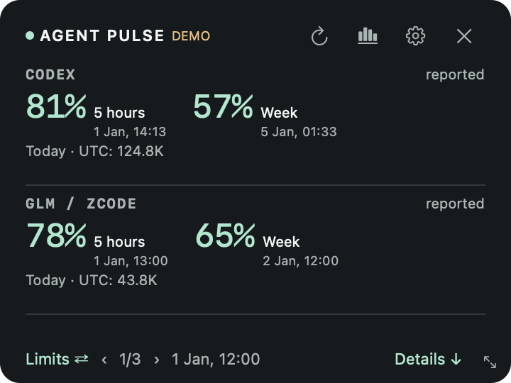
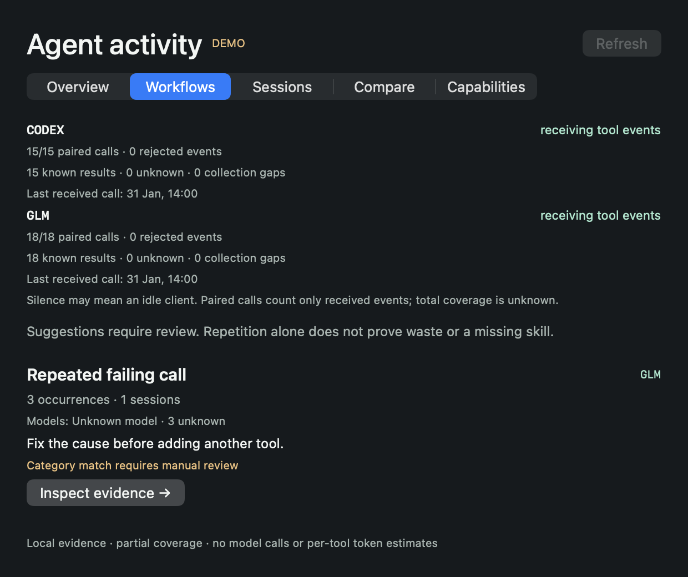
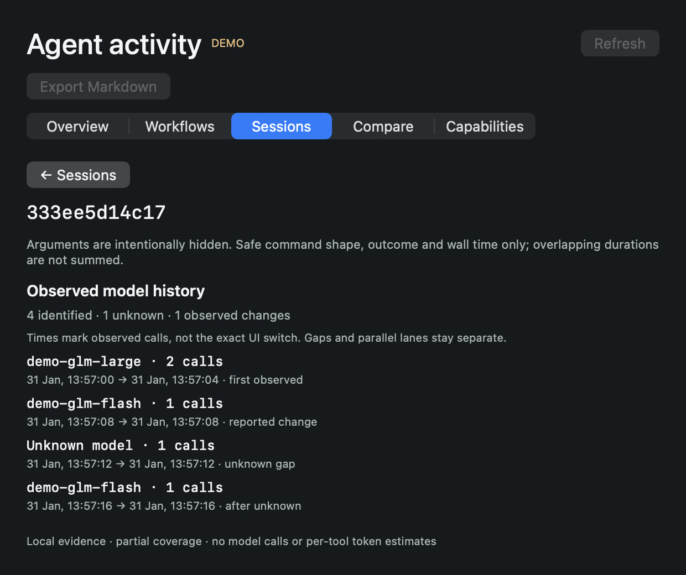
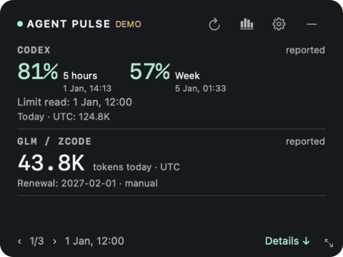
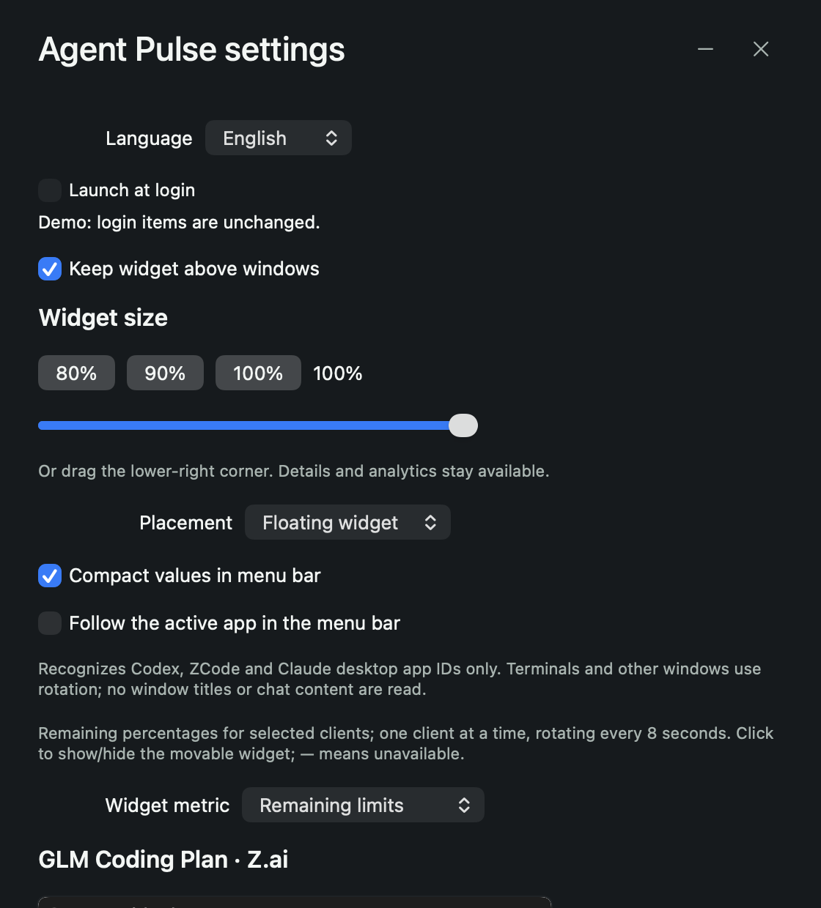
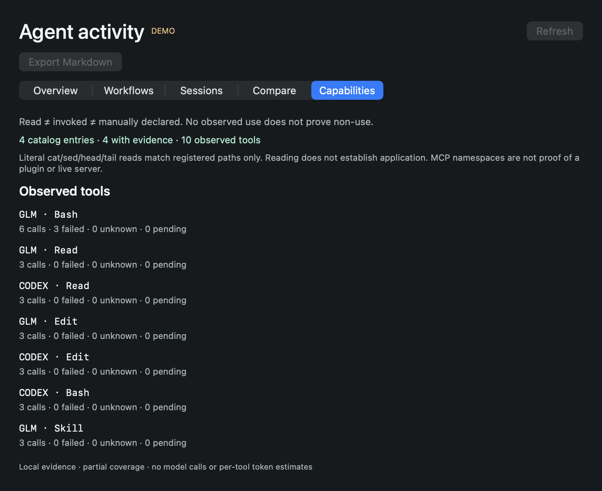

# Agent Pulse

[Reading empty values and continuing long sessions](docs/READING_ANALYTICS.md). Compact names are CODEX, CLAUDE, KIMI, GLM, etc.; the Mac menu has no page counter.

[Русский](README.ru.md) · [Downloads](https://github.com/Lobodagram/agent-pulse/releases) · [Provider setup](docs/PROVIDERS.md) · [Workflow analytics](docs/ANALYTICS.md)

A local tool for improving coding-agent workspaces: collect sanitized tool events, inspect repeated workflows and failures, and review evidence before automating a task or adding a skill/MCP. The desktop widget also shows reported tokens and subscription quotas.

[Linux/headless runtime](docs/HEADLESS.md) · Runtime wheel: Python 3.11+

**0.7.2 public preview.** macOS has a native SwiftUI/AppKit widget. Windows has an always-on-top Tk widget with a shared collector. Live provider coverage varies; selecting a client does not expose its private billing API.

**Confirm collection first:** configured observers are not proof of observation. After setup, start a new native session, review hook trust when required, perform an ordinary task, and check Workflows for actual paired calls. See the [readiness audit](docs/AUDIT.md). Capabilities separates exact registered skill-file loads, explicit invocations and manual declarations. No observed use is not proof of non-use; command families are bounded static classifications, not semantic understanding of arbitrary code.

[Model evidence and limitations](docs/MODELS.md). Per-call models and observed changes are shown only where native events report them; current UI selection never backfills history.

## What it does

- Choose clients and page through two at a time; drag the compact panel by its title.
- Show native remaining quota percentages and reset dates when a provider reports them.
- Keep reported daily tokens and local history, with explicit missing/stale/partial coverage.
- Record renewal or expiry dates locally, manually; these are separate from quota reset times.
- Opt into silent local Codex, ZCode or Claude hooks: pair tool starts/completions, outcomes, wall durations and task boundaries without saving raw payloads.
- Discover repeated 2–4 step workflows across at least three observed turns; inspect repeated identical inputs, failing retries and file-metadata repetition.
- Inspect sanitized session timelines and evidence behind each finding; manually label accepted/failed/rework outcomes and compare variants.
- Import or explicitly scan skill/MCP names; configured, available and unknown are distinct. Category matching does not prove a missing capability.
- Offer bounded evidence to your agent through an optional local read-only stdio MCP. Analysis itself calls no model.
- Refresh Codex quota reads every minute, counters every five minutes; show quota-source timestamps. Independent client reads can still briefly differ.
- Switch between English and Russian. macOS: menu bar, compact/detail view and charts. Windows preview: floating widget, tabbed workflows/sessions/comparison and settings.
- Run without model calls, prompts, telemetry uploads, browser credential scraping or corporate integrations.

## Honest provider coverage

| Client | Adapter | Available data | Verification |
| --- | --- | --- | --- |
| Codex | Native read-only app-server | Account quotas/resets; account tokens when supplied; optional partial local event projection | Live macOS + fixtures |
| GLM / ZCode | Native usage/stats | Local tokens, sessions and tool aggregates; **no remote paid-plan quota adapter** | Live macOS + fixtures |
| Claude Code | Opt-in official status-line bridge | Reported plan quotas and current context size; **context is not cumulative spend** | Contract + fixtures; no live account test |
| Kimi Code | Opt-in read-only quota endpoint | Reported quota percentages/resets; no inferred token spend | Experimental contract + fixtures |
| Qwen Code | Opt-in existing loopback dashboard | Native daily token/skill aggregates; no subscription quota API | Experimental contract + fixtures |
| Gemini CLI, Cursor, Copilot, Windsurf, DeepSeek, OpenRouter | Local normalized import | Only counters you explicitly export | Import + fixture tests; no automatic account connection |

[Setup and limitations](docs/PROVIDERS.md). No account cookies or client databases are read directly. Availability can change with client versions. Subscription allowances, token counts, API spend and context size are separate quantities. Tool-call frequency cannot establish exact per-tool token costs or guaranteed savings.

## Install

Download the matching zip from [Releases](https://github.com/Lobodagram/agent-pulse/releases): `macos-arm64` for Apple Silicon, `macos-x64` for Intel, or `windows-x64`.

**macOS 14+:** unzip, move `Agent Pulse.app` to Applications, open it. This preview is ad-hoc signed, **not Apple notarized**. If macOS blocks it, inspect the source/checksum and use Apple's documented approval flow only if you trust the download; the project does not disable Gatekeeper. Release packages contain their own collector runtime; native clients still need to be installed and authenticated by you.

**Windows 10/11 x64:** unzip into a folder you own and run `AgentPulse.exe`. No installer/admin permission needed. The executable is unsigned; SmartScreen reputation may be absent. Floating-window, compact-strip or system-tray mode is selectable in Settings. Hover the tray icon for counters and click to show/hide the widget; Windows may put the icon in its hidden-icons area. No automatic startup integration. Do not run a download you do not trust.

Open Settings, choose clients, enable event observers separately if desired, configure optional adapters using the provider guide and enter billing dates if desired. Selecting import-only clients shows **unavailable** until you supply metrics. No dates are guessed from subscription names.

For a source checkout, see [building](docs/BUILDING.md). Python 3.11+ is required for development; Python 3.12 is used for releases. macOS source builds need Xcode Command Line Tools. Linux can run the collector and tests; no Linux desktop package is promised.

## Privacy

Own state lives at `~/Library/Application Support/AgentPulse` on macOS, `%LOCALAPPDATA%\AgentPulse` on Windows and `$XDG_STATE_HOME/agent-pulse` (or `~/.local/state/agent-pulse`) for the Linux collector. It includes counters, manual dates, local configuration and a private journal of sanitized metadata and keyed hashes. Nothing is synchronized by this project.

Optional Codex event analysis is **off by default**. When enabled, it transiently parses bounded recent event files returned by native metadata and retains only counters/categories. It does not copy conversation text into telemetry. Native clients handle their own authentication and may have their own network/telemetry behavior. Kimi sends its opted-in key only to its official quota endpoint; Qwen uses an explicitly configured loopback address. Details: [PRIVACY.md](PRIVACY.md).

## License

**Open source under [MIT](LICENSE), by [Lobodagram](https://github.com/Lobodagram).** Personal and commercial use, modification, integration and sale are permitted. Keep the copyright and permission notice; MIT does not require prominent UI credit or opening modifications. [Licensing details](COMMERCIAL_LICENSE.md) · [Contributing](CONTRIBUTING.md).

The project is independent of OpenAI, Z.ai, Anthropic, Moonshot, Alibaba and other named vendors. Names identify compatible clients; no affiliation or endorsement is implied.

Account changes: on desktop, selected supported clients' authentication/config file metadata only is checked every five seconds (no credential file contents). A change clears displayed previous values and requests a fresh read. Codex additionally verifies a native account identifier, stored only as a keyed hash, and isolates current account quota cache; previous manual billing date is cleared on a verified account switch. Failed/unknown-identity Codex reads never reuse previous-account quotas. Async replies captured before a switch are discarded. This is best-effort client-specific detection, not instant universal IDE account discovery: keychain-only logins or clients without a supported signal may require the normal minute poll/manual refresh. ZCode local usage is client history, not an automatically account-separated paid-plan total.

Work history remains continuous across account switches. The journal groups by provider/task, not login. Known Codex daily account reports are stored per hashed account/day, updated (not incremented) on each read, then summed for general daily history. Switching back does not count the same account twice. Earlier unscoped rows remain stored; if they overlap a known-account day, they are not added because identity/overlap cannot be verified. Therefore totals cover observed accounts only, not every account ever used. Current quotas and manual billing dates remain account-specific; GLM local aggregates remain client history.

### Smaller widget and menu bar

Settings offers 80%, 90% and 100% sizes and a continuous slider; drag the lower-right grip to change the proportional size. The smallest Mac widget is 288×216 points, with all displayed fields preserved; details/analytics stay available. On macOS choose **Menu bar only**: click the status icon to open the full widget, right-click for actions. The bar rotates **one enabled client every 8 seconds**, showing its first two reported quota windows. Enable **Follow the active app** to prioritize a recognized Codex, ZCode or Claude desktop app; unrecognized apps and terminal-hosted CLIs fall back to rotation. Only the foreground bundle identifier is used, never window/chat contents. Unknown quotas show —; token counts are not turned into percentages. Icon-only saves menu-bar space. macOS owns the position beside the camera. Windows supports floating-widget scaling (320×248 minimum) and system-tray mode beside the clock. Collapse opens a small quota strip above the taskbar, paging up to three clients every 8 seconds. Click a row or ↗ to restore the full widget; × quits. **Tray only** hides it instead; hover for bounded counters, click to reopen, right-click for actions. The strip is a separate window, not text embedded inside the Windows taskbar. If the tray is unavailable the widget stays visible; the icon recovers after Explorer restarts.

A missing Codex daily bucket means **awaiting report**, not zero. Enable **Local Codex tokens today · partial** and Apply in Settings for bounded local token-count events when the account report lags. It is off by default; UTC day and partial device-wide coverage across logins. No account/local totals are added together.

The **− / ⌄** button collapses into the menu bar/compact strip; **×** quits Agent Pulse. Reopening a production app does not create another instance. Test fixtures are isolated and automatically closed.

[Plugin and in-client integration feasibility](docs/INTEGRATIONS.md). No badge-in-every-desktop-chat plugin is included in this release.

[New evidence contracts, command families and review packs](docs/EVIDENCE.md). Mac Analytics/Settings restore and focus the existing window on the active Space above ordinary windows.

[Improvement loop and delivery helper](docs/IMPROVEMENT_LOOP.md)
