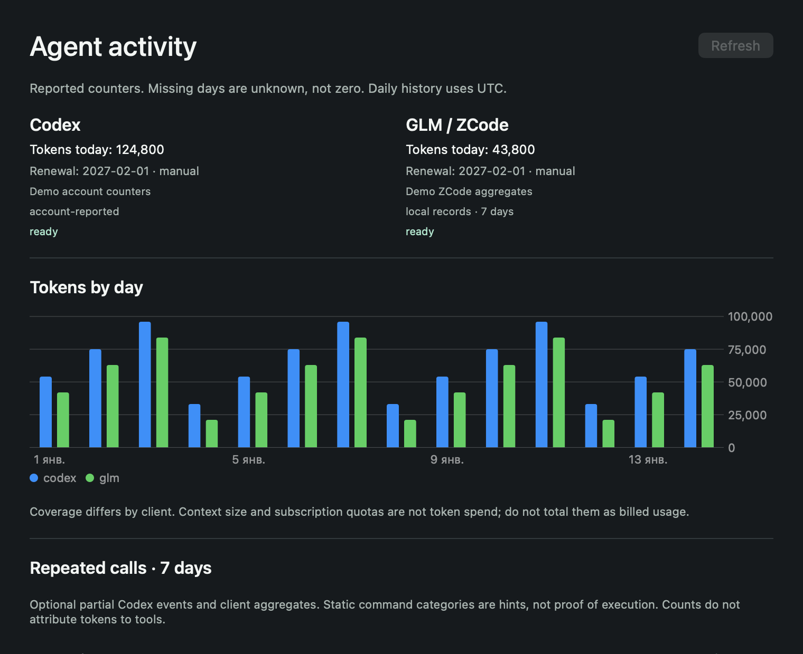

# Agent Pulse

[Русский](README.ru.md) · [Downloads](https://github.com/Lobodagram/agent-pulse/releases) · [Provider setup](docs/PROVIDERS.md)

A small, local desktop dashboard for understanding your coding agents: remaining subscription quotas, reported tokens, reset times, manually entered billing dates and repeated tool calls. It sits above your windows without occupying your editor.

**0.2.1 public preview.** macOS has a native SwiftUI/AppKit widget. Windows has an always-on-top Tk widget with a shared collector. Live provider coverage varies; selecting a client does not magically expose its private billing API.

## What it does

- Choose clients and page through two at a time; drag the compact panel by its title.
- Show native remaining quota percentages and reset dates when a provider reports them.
- Keep reported daily tokens and local history, with explicit missing/stale/partial coverage.
- Record renewal or expiry dates locally, manually; these are separate from quota reset times.
- Review repeated tool categories to decide whether an existing workflow, skill, local tool or MCP would help.
- Switch between English and Russian. macOS: menu bar, compact/detail view and charts. Windows preview: floating widget, scrollable history and settings.
- Run without model calls, prompts, telemetry uploads, browser credential scraping or corporate integrations.

## Honest provider coverage

| Client | Adapter | Available data | Verification |
| --- | --- | --- | --- |
| Codex | Native read-only app-server | Account quotas/resets; account tokens when supplied; optional partial local event projection | Live macOS + fixtures |
| GLM / ZCode | Native usage/stats | Local tokens, sessions and tool aggregates; **no remote paid-plan quota adapter** | Live macOS + fixtures |
| Claude Code | Opt-in official status-line bridge | Reported plan quotas and current context size; **context is not cumulative spend** | Contract + fixtures; no live account test |
| Kimi Code | Opt-in read-only quota endpoint | Reported quota percentages/resets; no inferred token spend | Experimental contract + fixtures |
| Qwen Code | Opt-in existing loopback dashboard | Native daily token/skill aggregates; no subscription quota API | Experimental contract + fixtures |
| Gemini CLI, Cursor, Copilot, Windsurf, DeepSeek, OpenRouter | Local normalized import | Only counters you explicitly export | Import + fixture tests; no automatic account connection |

[Setup and limitations](docs/PROVIDERS.md). No account cookies or client databases are read directly. Availability can change with client versions. Subscription allowances, token counts, API spend and context size are separate quantities. Tool-call frequency cannot establish exact per-tool token costs or guaranteed savings.

## Install

Download the matching zip from [Releases](https://github.com/Lobodagram/agent-pulse/releases): `macos-arm64` for Apple Silicon, `macos-x64` for Intel, or `windows-x64`.

**macOS 14+:** unzip, move `Agent Pulse.app` to Applications, open it. This preview is ad-hoc signed, **not Apple notarized**. If macOS blocks it, inspect the source/checksum and use Apple's documented approval flow only if you trust the download; the project does not disable Gatekeeper. Release packages contain their own collector runtime; native clients still need to be installed and authenticated by you.

**Windows 10/11 x64:** unzip into a folder you own and run `AgentPulse.exe`. No installer/admin permission needed. The executable is unsigned; SmartScreen reputation may be absent. This preview has a close button; no tray/startup integration yet. Do not run a download you do not trust.

Open Settings, choose clients, configure optional adapters using the provider guide and enter billing dates if desired. Selecting import-only clients shows **unavailable** until you supply metrics. No dates are guessed from subscription names.

For a source checkout, see [building](docs/BUILDING.md). Python 3.10+ is required for development; Python 3.12 is used for releases. macOS source builds need Xcode Command Line Tools. Linux can run the collector and tests; no Linux desktop package is promised.

## Privacy

Own state lives at `~/Library/Application Support/AgentPulse` on macOS, `%LOCALAPPDATA%\AgentPulse` on Windows and `$XDG_STATE_HOME/agent-pulse` (or `~/.local/state/agent-pulse`) for the Linux collector. It includes counters, sanitized tool names, manual dates and local configuration. Nothing is synchronized by this project.

Optional Codex event analysis is **off by default**. When enabled, it transiently parses bounded recent event files returned by native metadata and retains only counters/categories. It does not copy conversation text into telemetry. Native clients handle their own authentication and may have their own network/telemetry behavior. Kimi sends its opted-in key only to its official quota endpoint; Qwen uses an explicitly configured loopback address. Details: [PRIVACY.md](PRIVACY.md).

## License

**Source-available, free for noncommercial use. Commercial use requires a separately purchased written license from [Lobodagram](https://github.com/Lobodagram).** This is not an OSI open-source license.

The code is under [PolyForm Noncommercial 1.0.0](LICENSE). Noncommercial personal use, changes and redistribution are permitted subject to its terms; the standard license also permits the noncommercial organizations it describes. Keep the license and Required Notice. [Commercial licensing](COMMERCIAL_LICENSE.md) · [Contributing](CONTRIBUTING.md).

The project is independent of OpenAI, Z.ai, Anthropic, Moonshot, Alibaba and other named vendors. Names identify compatible clients; no affiliation or endorsement is implied.
