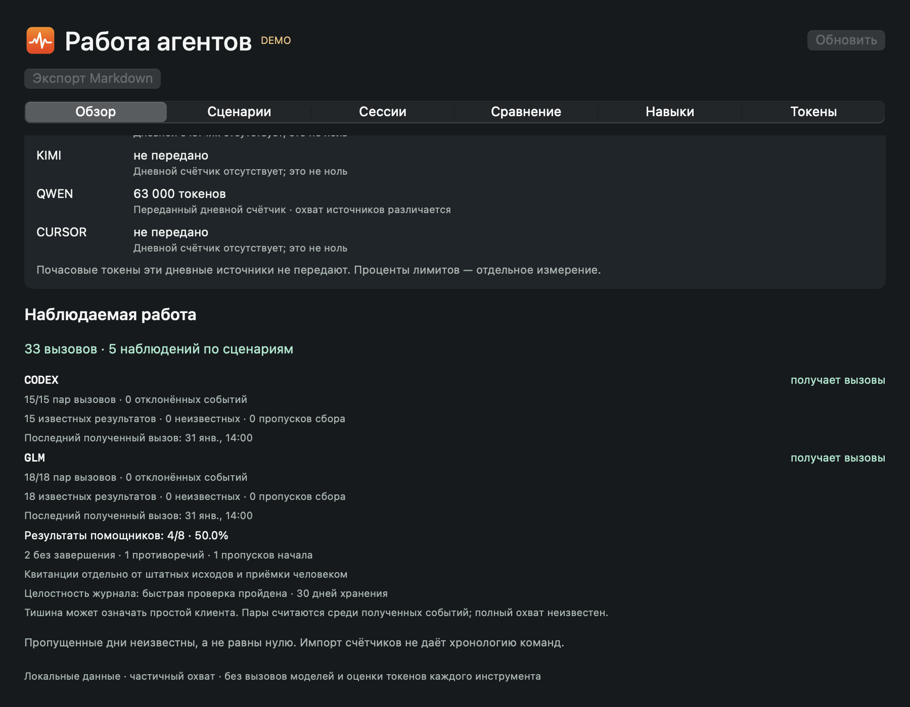
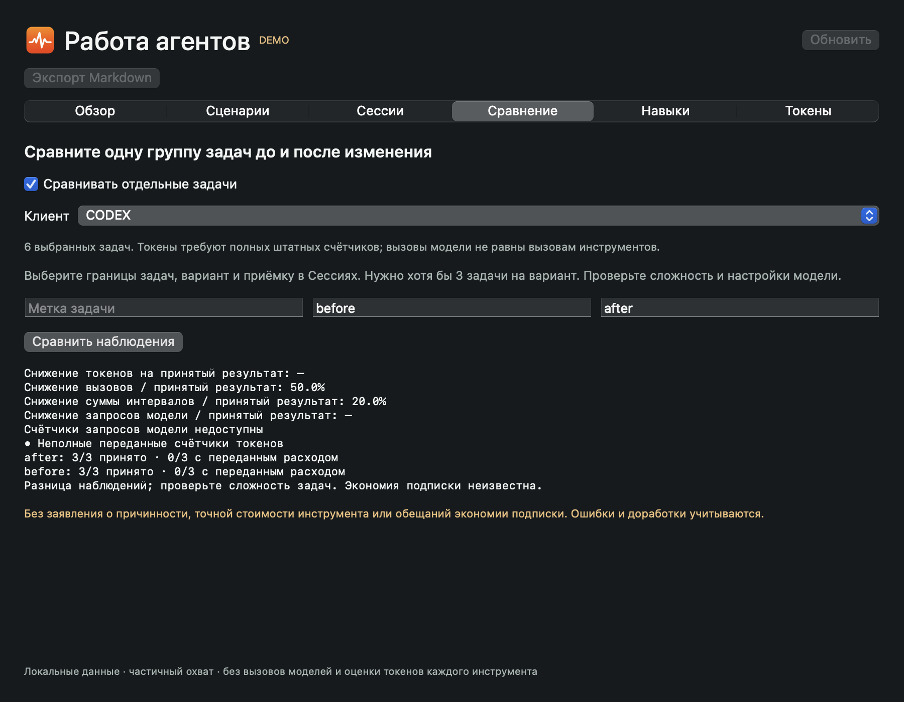
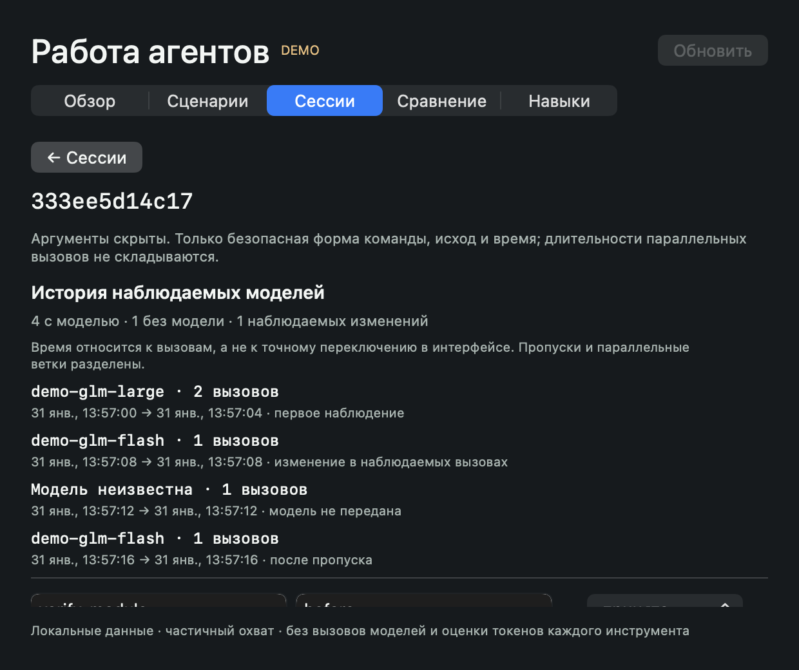
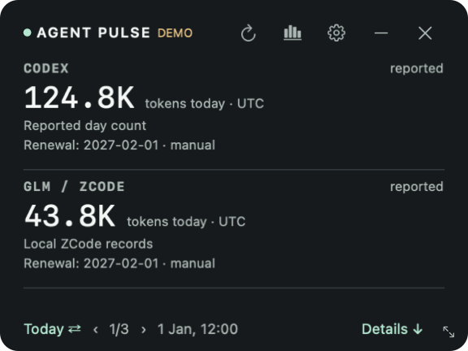
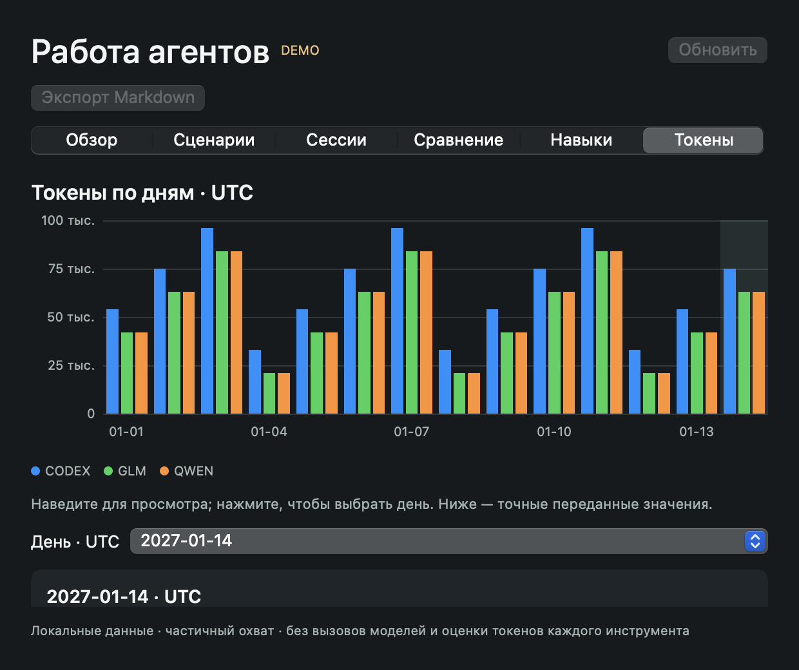
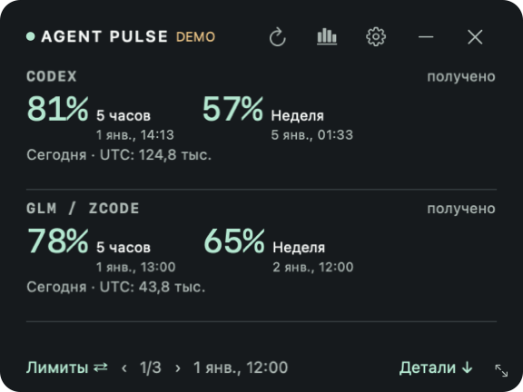
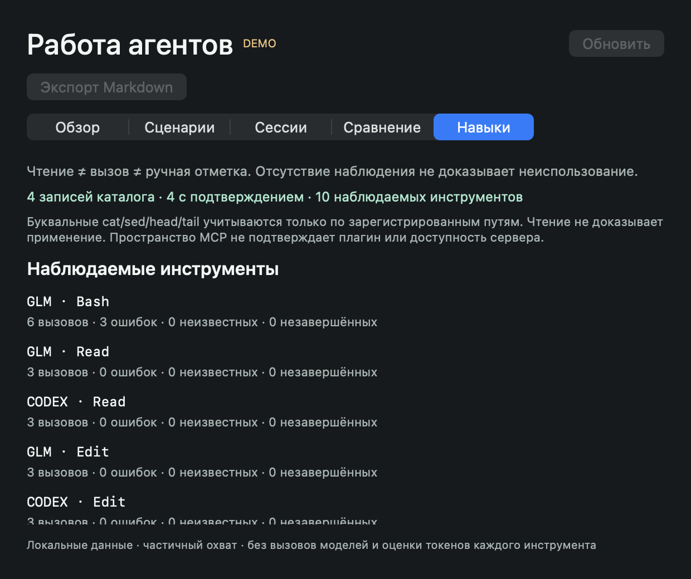

# Agent Pulse

Виджет: **«Лимиты ⇄ / Сегодня ⇄»**, выбор сохраняется; квоты личного GLM Coding Plan подключаются через закрытое поле в настройках. [Настройка и границы данных](docs/PROVIDERS.ru.md).

[Как читать пустые значения и продолжать длинные сессии](docs/READING_ANALYTICS.ru.md). В панели полные названия CODEX, CLAUDE, KIMI, GLM и другие без номера страницы.

[English](README.md) · [Скачать](https://github.com/Lobodagram/agent-pulse/releases/tag/v0.11.2) · [Подключение клиентов](docs/PROVIDERS.ru.md)

Локальный инструмент для улучшения работы ИИ-агентов: сбор очищенных событий инструментов, поиск повторяющихся сценариев и сбоев, проверка примеров перед автоматизацией или добавлением скилла/MCP. Виджет дополнительно показывает переданные токены и лимиты подписок.

[Установка агентом: ОС, зависимости, навыки и MCP](docs/AGENT_SETUP.ru.md)

[Архитектура и ответственность модулей](docs/ARCHITECTURE.md) · [Linux и режим без виджета](docs/HEADLESS.ru.md) · Runtime wheel: Python 3.11+

**[0.11.2 — открытая предварительная версия](https://github.com/Lobodagram/agent-pulse/releases/tag/v0.11.2).** Реальный аккаунт Kimi не проверен; настройки и изолированные проверки выполнены. Пакеты и результаты их проверки указаны ниже и в [QA](docs/QA.md). На macOS используется SwiftUI/AppKit; Windows получает виджет на Tk и тот же сборщик статистики. Выбор клиента не означает, что его закрытые данные оплаты доступны автоматически.

В 0.11.2 добавлены результаты проверок помощников, диагностика журнала и проверенные резервные копии. Вызовы, время задач, запросы модели и токены сравниваются с отдельными условиями полноты. Автозапуск macOS проверен после реальной перезагрузки рабочего Mac; физическая приёмка Windows и реальный аккаунт Kimi проверяются отдельно. [Изменения релиза](docs/RELEASE_NOTES.md) · [Результаты проверок](docs/QA.md).

**Сначала подтвердите сбор:** настройка наблюдателя не доказывает поступление событий. После настройки начните новую сессию клиента, пройдите проверку доверия хуку, если клиент её требует, выполните обычную задачу и проверьте пары вызовов в «Сценариях». См. [аудит готовности](docs/AUDIT.ru.md). Имена скиллов в перечне не доказывают их использование или неиспользование; вкладка «Навыки» отдельно учитывает зарегистрированное чтение, явный вызов и ручную отметку. Семейства команд не заменяют смысловой анализ произвольного кода.

[Источники и ограничения моделей](docs/MODELS.ru.md). Модели вызовов и наблюдаемые изменения показываются только по событиям клиента. Текущий выбор модели не подставляется в прошлую историю.

Аналитика → Токены: понятные единицы, просмотр при наведении, выбор дня нажатием или через список и точные значения по клиентам. В Windows — «Токены по дням». Почасовых токенов дневные источники не передают. Локальный счётчик Codex добровольный и частичный; пропущенная история обозначается и не восстанавливается из общего накопительного значения.

## Возможности

- Выбор клиентов, компактное отображение по два и перелистывание; перетаскивание за заголовок.
- Остаток лимитов и даты сброса, когда источник их передаёт.
- История токенов с явными отметками пропусков, устаревания и частичного охвата.
- Локальные даты продления/окончания подписок, введённые вручную. Это отдельные даты, не сбросы лимитов.
- Добровольные локальные наблюдатели Codex/ZCode/Claude/Kimi Code 2.x: начало/завершение вызовов, результаты, время и границы задач без сохранения исходных запросов и ответов.
- Повторяющиеся цепочки из 2–4 категорий, одинаковые запросы, сбои и чтения; просмотр примеров, метки качества и сравнение вариантов работы.
- Перечень скиллов/MCP с различием «настроен»/«доступен»/«неизвестно»; локальный MCP с шестью инструментами чтения аналитики. Сам анализ не вызывает модели.
- Добровольный автозапуск при входе, с галочкой в настройках; по умолчанию выключен.
- Русский и английский интерфейс. На macOS — строка меню, детали и графики; Windows preview — плавающий виджет, история и настройки.
- Без вызовов моделей, отправки промптов, выгрузки телеметрии или чтения cookies.

## Реальная поддержка

| Клиент | Подключение | Какие данные | Проверка |
| --- | --- | --- | --- |
| Codex | Штатный app-server, чтение | Лимиты/сбросы, переданные токены аккаунта; опционально частичные локальные события | Реальный macOS + тесты |
| GLM / ZCode | Штатный usage/stats | Локальные токены, сессии, инструменты; личные квоты Z.ai по отдельному ключу (живая проверка на Mac пройдена) | Реальный macOS + тесты |
| Claude Code | Опциональный мост status-line | Переданные лимиты и размер текущего контекста; **контекст не равен расходу** | Контракт + тесты, без реального аккаунта |
| Kimi Code 2.x | Отдельный ключ квот + добровольные TOML-наблюдатели | Проценты/сбросы и события инструментов; квоты не передают расход токенов | Контракт + тесты; живая приёмка аккаунта отдельно |
| Kimi Work/Chat | Отдельное приложение | Вход и подписка приложения не подключают автоматически Kimi Code | Автоматический сбор не подтверждён |
| Qwen Code | Уже запущенный локальный dashboard | Агрегаты токенов по дням и вызовов skills; без API лимитов подписки | Экспериментальный адаптер, тесты |
| Gemini CLI, Cursor, Copilot, Windsurf, DeepSeek, OpenRouter | Локальный импорт | Только явно выгруженные вами счётчики | Тесты импорта; автоматического подключения аккаунтов нет |

[Настройка и ограничения](docs/PROVIDERS.ru.md). Приложение не читает напрямую базы клиентов. Контракты могут меняться с их версиями. Лимит подписки, токены, стоимость API и контекст — разные измерения. Частота вызовов не доказывает точный расход токенов на инструмент или гарантированную экономию.

## Установка

В [Releases](https://github.com/Lobodagram/agent-pulse/releases/tag/v0.11.2) выберите zip: `macos-arm64` для Apple Silicon, `macos-x64` для Intel, `windows-x64` для Windows.

**macOS 14+:** распакуйте, перенесите `Agent Pulse.app` в Applications, откройте. Предварительная сборка подписана ad-hoc, **нотариализации Apple нет**. Если система блокирует запуск, проверьте исходники и контрольную сумму и используйте штатное подтверждение Apple только для доверенной загрузки. Защита Gatekeeper приложением не отключается. Сборка релиза содержит runtime сборщика; клиенты нужно установить и авторизовать самостоятельно.

**Windows 10/11 x64:** распакуйте в свою папку и запустите `AgentPulse.exe`. Установщик и права администратора не нужны. Цифровой подписи нет; репутация SmartScreen может отсутствовать. В настройках выбирается плавающее окно или системный трей: наведение показывает счётчики, нажатие открывает табло. Windows может убрать значок под стрелку скрытых значков. Автозапуск выключен по умолчанию; включается галочкой в настройках. Не запускайте загрузку, которой не доверяете.

В настройках выберите клиентов, настройте мосты по инструкции и при желании укажите даты подписок. Клиенты только с импортом показывают «нет данных», пока счётчики не загружены. Даты оплаты автоматически не угадываются.

[Сборка из исходников](docs/BUILDING.ru.md): Python 3.11+, для релизов 3.12; macOS также требует Xcode Command Line Tools. На Linux работают сборщик и тесты; отдельного desktop-пакета пока нет.

## Приватность

Собственные данные: `~/Library/Application Support/AgentPulse` на macOS, `%LOCALAPPDATA%\AgentPulse` на Windows, `$XDG_STATE_HOME/agent-pulse` или `~/.local/state/agent-pulse` для Linux. Здесь счётчики, безопасные имена инструментов, ручные даты и настройки. Проект ничего не синхронизирует.

Анализ локальных событий Codex **выключен по умолчанию**. После включения ограниченные недавние файлы событий временно разбираются; сохраняются только числа и категории. Тексты переписки в телеметрию не копируются. Штатные клиенты сами управляют своей авторизацией и сетевым поведением. Опциональный Kimi передаёт ключ только официальному API лимитов; Qwen использует явно выбранный loopback. [Подробности](PRIVACY.md).

## Лицензия

Код новых версий открыт по [AGPL-3.0-only](LICENSE), автор — [Lobodagram](https://github.com/Lobodagram). Личное и коммерческое использование разрешено; распространение и изменённые сетевые версии связаны с обязанностями открыть соответствующий исходный код. Прежние MIT-права сохраняются. [Подробнее](COMMERCIAL_LICENSE.md) · [Участие](CONTRIBUTING.md).

Проект независим от OpenAI, Z.ai, Anthropic, Moonshot, Alibaba и остальных названных поставщиков. Названия обозначают совместимые клиенты, а не партнёрство или одобрение.

## Сценарии и доказательства

Наблюдатели Codex, ZCode и Claude включаются отдельно в настройках. Они без вывода в чат записывают пары начала/завершения инструментов, исходы, время и границы задач. Сохраняются очищенные метаданные и хеши, без текста запросов, аргументов, результатов и кода.

Разделы «Сценарии» и «Сессии» показывают повторяющиеся цепочки из 2–4 действий, ошибки и конкретные примеры. Можно отметить результат задачи и сравнить варианты до/после. Каталог скиллов/MCP позволяет отличать настроенное от проверенно доступного; неполный каталог не доказывает отсутствие инструмента. Для чтения аналитики агентом есть отдельный локальный MCP.

Лимиты Codex обновляются раз в минуту, счётчики — раз в пять минут. В виджете есть время получения самого лимита. Независимые ответы клиентов всё ещё могут на короткое время расходиться. Это проценты подписочного лимита, не оставшееся число токенов.

[Настройка, пороги, ограничения и сравнение](docs/ANALYTICS.ru.md). Полное наблюдение каждого действия всех клиентов не обещается; импортированные агрегаты не создают хронологию команд.

Смена аккаунта: каждые пять секунд проверяются только метаданные файлов входа/конфигурации выбранных поддерживаемых клиентов, без чтения секретов. Изменение убирает прежние значения и запрашивает свежие. Codex дополнительно проверяет штатный идентификатор аккаунта, сохраняя лишь локальный HMAC: текущие квоты аккаунтов не смешиваются, прежняя ручная дата оплаты очищается при подтверждённой смене. При неизвестном аккаунте/ошибке прежние квоты не подставляются; запоздавшие ответы отбрасываются. Это поддерживаемые сигналы, не универсальное мгновенное определение аккаунтов всех IDE: вход только через Keychain или неподдерживаемый клиент может требовать минутного опроса/ручного обновления. Статистика ZCode — локальная история клиента, не автоматически разделённая платная статистика аккаунтов.

Общая история работы остаётся непрерывной при смене аккаунтов. Журнал объединяется по провайдеру/задаче, без разделения по логинам. Дневные отчёты Codex сохраняются по хешу аккаунта и дню, обновляются без повторного прибавления и затем суммируются. Возврат в старый аккаунт не удваивает его расход. Прежние записи без установленного аккаунта сохраняются, но не прибавляются к пересекающемуся известному дню: иначе нельзя исключить двойной счёт. Общий расход охватывает наблюдаемые аккаунты, не обещает учёт всех когда-либо использованных. Текущие квоты/даты оплаты остаются отдельно; GLM сохраняет локальную историю клиента.

### Маленькое табло и строка меню

В настройках доступны 80%, 90%, 100% и плавный ползунок. Можно тянуть за нижний правый угол; окно и текст уменьшаются пропорционально, все показанные поля сохраняются. Минимум Mac — 288×216 точек; детали и аналитика доступны отдельно. Режим **Только строка меню** убирает постоянную плашку: нажатие значка открывает табло, правая кнопка — действия. Сверху **каждые 8 секунд чередуется один выбранный клиент**, с двумя первыми переданными окнами лимитов.
Включите **Следовать за активным приложением сверху**, чтобы выбирать распознанные Codex, ZCode или Claude;
другие приложения и CLI в терминале возвращают чередование. Используется только идентификатор приложения,
содержимое окон и чатов не читается. Неизвестный лимит — «—», токены не превращаются в проценты.
Можно оставить один значок. Положение рядом с камерой определяет macOS.
На Windows сворачивание открывает маленькую полоску над панелью задач: до трёх клиентов, страницы каждые 8 секунд.
Нажмите строку или ↗, чтобы вернуть полное табло; × закрывает программу.
Режим **только трей** скрывает окно: значок возвращает его, наведение показывает счётчики, правая кнопка — действия.
Полоска является отдельным окном, она не встроена внутрь панели Windows. Если трей недоступен,
окно остаётся видимым; после перезапуска Проводника значок восстанавливается.

Если дневной отчёт Codex ещё не включает сегодня, показывается **жду отчёт**. Включите **Локальные токены Codex за сегодня · частично** и примените выбор: счётчик использует ограниченные доступные события токенов. По умолчанию выключен; день UTC, частичный охват работы на устройстве через смену аккаунтов. Аккаунтный и локальный расход не складываются.

На macOS **×** скрывает виджет, оставляя Pulse работающим; завершение доступно через правый клик в строке меню или Command-Q. На Windows **⌄** открывает компактную полоску, а **×** завершает программу. Повторный запуск не создаёт второй рабочий экземпляр; тестовые окна изолированы.

[Возможности плагинов и интеграции внутри клиентов](docs/INTEGRATIONS.md).
Плагина с индикатором в каждом десктопном чате в этом релизе нет.

[Цикл улучшений и общая команда проверки](docs/IMPROVEMENT_LOOP.ru.md)

## Настройка через агента

Пришлите агенту ссылку на репозиторий и предложите следовать [инструкции](docs/AGENT_SETUP.ru.md). Два переносимых навыка отвечают за настройку и анализ работы. MCP по умолчанию читает данные; явный `--allow-control` разрешает ограниченные настройки, ручные даты подписок и решения по находкам. Ключи, произвольные команды и вызовы моделей через него недоступны.

Окна аналитики и настроек обычные: при переключении приложения уходят назад. Кнопка виджета или меню возвращает окно вперёд; повторное нажатие скрывает активное окно. На macOS: **⌘1** — аналитика, **⌘,** — настройки. «Поверх окон» относится только к виджету.

### Закрытие окон на Mac

Крестик **×** скрывает виджет; Agent Pulse продолжает работать. Нажмите на пункт Pulse в верхней строке, чтобы вернуть виджет. Правый клик или клик двумя пальцами открывает меню с пунктом **«Завершить Agent Pulse»**; также работает Command-Q. В настройках отдельные заметные кнопки закрывают и сворачивают окно, не завершая программу.

[Польза скиллов/MCP и метрики кэша](docs/EFFICIENCY.ru.md): приёмка выбранных задач, версии и полнота данных; без выдуманной экономии подписки.

[Полнота сбора и хранение](docs/COLLECTION_HEALTH.ru.md): результаты помощников, анализ всего сохранённого окна, проверенные копии журнала без ключей и отдельные условия полноты операционных метрик.
