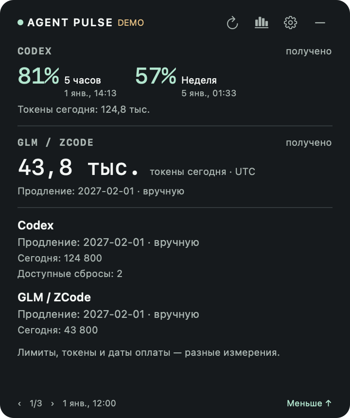
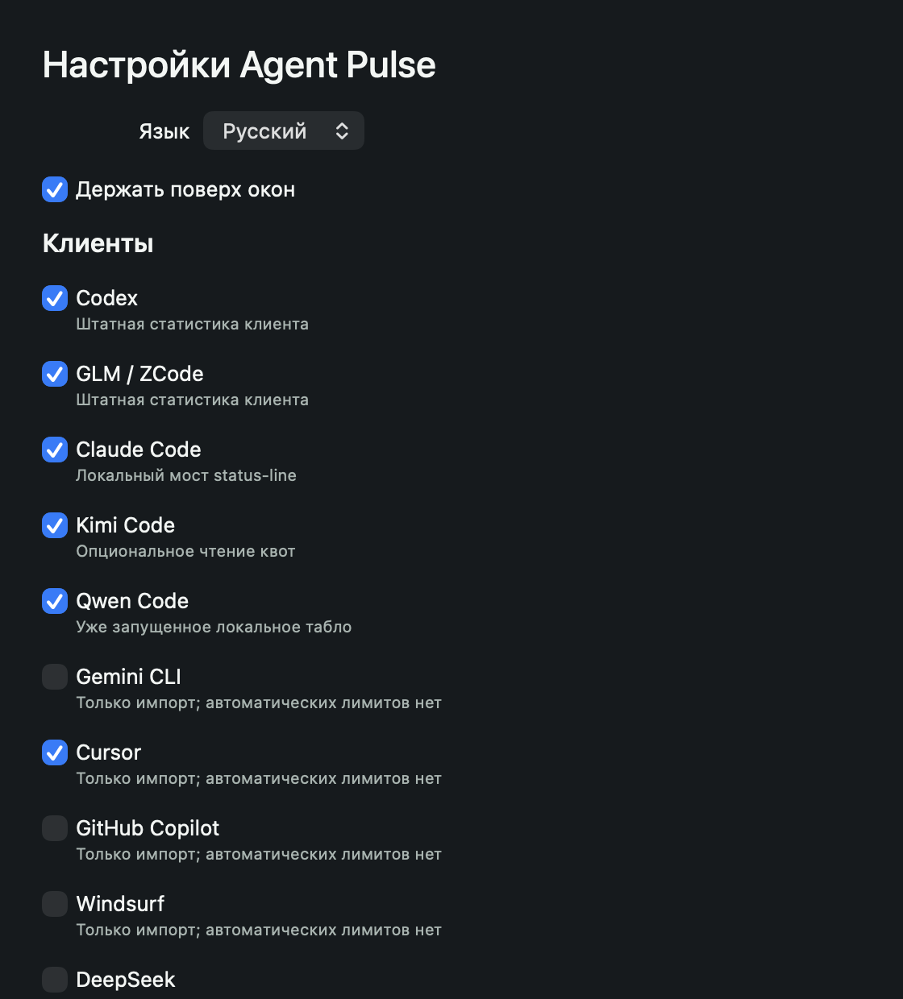

# Agent Pulse

[English](README.md) · [Скачать](https://github.com/Lobodagram/agent-pulse/releases) · [Подключение клиентов](docs/PROVIDERS.ru.md)

Небольшое локальное табло для работы с ИИ-помощниками: остаток лимитов подписки, полученные счётчики токенов, даты сброса, вручную введённые даты оплаты и повторяющиеся вызовы инструментов. Виджет можно держать поверх окон рядом с редактором.

**0.2.0 — публичная предварительная версия.** На macOS используется SwiftUI/AppKit; Windows получает виджет на Tk и тот же сборщик статистики. Выбор клиента не означает, что его закрытые данные оплаты доступны автоматически.

## Возможности

- Выбор клиентов, компактное отображение по два и перелистывание; перетаскивание за заголовок.
- Остаток лимитов и даты сброса, когда источник их передаёт.
- История токенов с явными отметками пропусков, устаревания и частичного охвата.
- Локальные даты продления/окончания подписок, введённые вручную. Это отдельные даты, не сбросы лимитов.
- Повторяющиеся категории вызовов: материал для проверки, нужен ли скилл, инструмент или MCP.
- Русский и английский интерфейс. На macOS — строка меню, детали и графики; Windows preview — плавающий виджет, история и настройки.
- Без вызовов моделей, отправки промптов, выгрузки телеметрии или чтения cookies.

## Реальная поддержка

| Клиент | Подключение | Какие данные | Проверка |
| --- | --- | --- | --- |
| Codex | Штатный app-server, чтение | Лимиты/сбросы, переданные токены аккаунта; опционально частичные локальные события | Реальный macOS + тесты |
| GLM / ZCode | Штатный usage/stats | Локальные токены, сессии, инструменты; **удалённые лимиты платной подписки не подключены** | Реальный macOS + тесты |
| Claude Code | Опциональный мост status-line | Переданные лимиты и размер текущего контекста; **контекст не равен расходу** | Контракт + тесты, без реального аккаунта |
| Kimi Code | Опциональный API чтения лимитов | Проценты/сбросы; расход токенов не вычисляется из квоты | Экспериментальный адаптер, тесты |
| Qwen Code | Уже запущенный локальный dashboard | Агрегаты токенов по дням и вызовов skills; без API лимитов подписки | Экспериментальный адаптер, тесты |
| Gemini CLI, Cursor, Copilot, Windsurf, DeepSeek, OpenRouter | Локальный импорт | Только явно выгруженные вами счётчики | Тесты импорта; автоматического подключения аккаунтов нет |

[Настройка и ограничения](docs/PROVIDERS.ru.md). Приложение не читает напрямую базы клиентов. Контракты могут меняться с их версиями. Лимит подписки, токены, стоимость API и контекст — разные измерения. Частота вызовов не доказывает точный расход токенов на инструмент или гарантированную экономию.

## Установка

В [Releases](https://github.com/Lobodagram/agent-pulse/releases) выберите zip: `macos-arm64` для Apple Silicon, `macos-x64` для Intel, `windows-x64` для Windows.

**macOS 14+:** распакуйте, перенесите `Agent Pulse.app` в Applications, откройте. Предварительная сборка подписана ad-hoc, **нотариализации Apple нет**. Если система блокирует запуск, проверьте исходники и контрольную сумму и используйте штатное подтверждение Apple только для доверенной загрузки. Защита Gatekeeper приложением не отключается. Сборка релиза содержит runtime сборщика; клиенты нужно установить и авторизовать самостоятельно.

**Windows 10/11 x64:** распакуйте в свою папку и запустите `AgentPulse.exe`. Установщик и права администратора не нужны. Цифровой подписи нет; репутация SmartScreen может отсутствовать. В этой версии есть закрытие окна, но пока нет трея и автозапуска. Не запускайте загрузку, которой не доверяете.

В настройках выберите клиентов, настройте мосты по инструкции и при желании укажите даты подписок. Клиенты только с импортом показывают «нет данных», пока счётчики не загружены. Даты оплаты автоматически не угадываются.

[Сборка из исходников](docs/BUILDING.ru.md): Python 3.10+, для релизов 3.12; macOS также требует Xcode Command Line Tools. На Linux работают сборщик и тесты; отдельного desktop-пакета пока нет.

## Приватность

Собственные данные: `~/Library/Application Support/AgentPulse` на macOS, `%LOCALAPPDATA%\AgentPulse` на Windows, `$XDG_STATE_HOME/agent-pulse` или `~/.local/state/agent-pulse` для Linux. Здесь счётчики, безопасные имена инструментов, ручные даты и настройки. Проект ничего не синхронизирует.

Анализ локальных событий Codex **выключен по умолчанию**. После включения ограниченные недавние файлы событий временно разбираются; сохраняются только числа и категории. Тексты переписки в телеметрию не копируются. Штатные клиенты сами управляют своей авторизацией и сетевым поведением. Опциональный Kimi передаёт ключ только официальному API лимитов; Qwen использует явно выбранный loopback. [Подробности](PRIVACY.md).

## Лицензия

**Исходники доступны; некоммерческое использование бесплатно. Коммерческое — только по отдельно приобретённой письменной лицензии у [Lobodagram](https://github.com/Lobodagram).** Это source-available, а не неограниченная open-source лицензия.

Код опубликован по [PolyForm Noncommercial 1.0.0](LICENSE). Разрешены некоммерческое личное использование, изменения и распространение с соблюдением условий; стандартная лицензия также разрешает перечисленные в ней некоммерческие организации. Сохраняйте лицензию и Required Notice. [Коммерческая лицензия](COMMERCIAL_LICENSE.md) · [Участие в разработке](CONTRIBUTING.md).

Проект независим от OpenAI, Z.ai, Anthropic, Moonshot, Alibaba и остальных названных поставщиков. Названия обозначают совместимые клиенты, а не партнёрство или одобрение.
