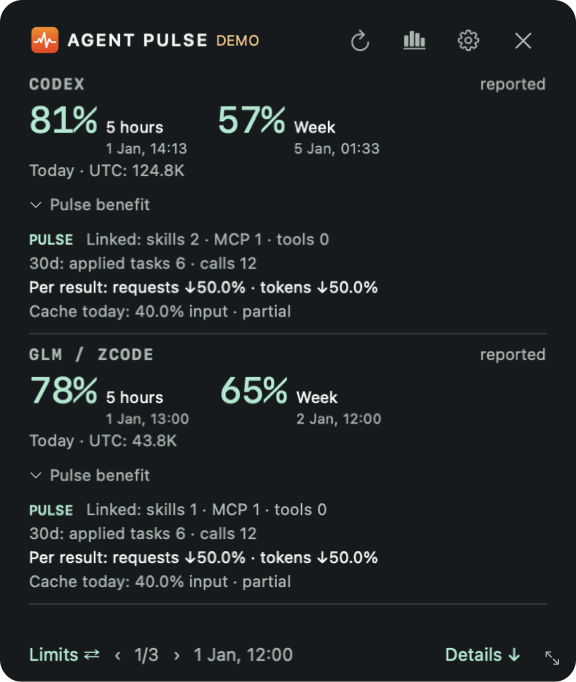

# Widget benefit evidence

[Русский](WIDGET_BENEFIT.ru.md)

The floating widget has a **Pulse benefit** disclosure beneath each client's daily counters. It starts collapsed. Click to expand or collapse that client independently; the window adjusts its height. The monochrome menu bar and Windows compact quota strip retain their existing presentation. Refresh updates the block with the current local evidence; the regular full refresh is every five minutes.

- **Linked skills / MCP / tools**: distinct registered asset IDs explicitly linked to a validated Pulse finding; versions are deduplicated. This is an all-registry count, not a count of tools created today or automatically created by Pulse.
- **30d applied tasks / calls**: declared applications in reviewed task selections linked to those asset versions, and observed native capability invocations in the retained window. These are different measures. Reading a skill file or listing an MCP does not count as an invocation. Partial coverage remains partial; zero observed invocations does not prove non-use.
- **Model requests / tokens**: differences per accepted result in one explicitly pinned comparison. In **Analytics → Compare**, choose the client, task label, before and after variants, then **Pin pair in widget**. Clear the pair there too. Pulse does not choose the best-looking comparison. Full native receipts, at least three tasks per variant, matching observed cohorts and reviewed quality are required by the same comparison gates as the detailed report. All selected attempts, including failed/rework results, remain in the denominator calculation. Down arrows mean reduction; up arrows mean increased consumption; zero and unavailable are distinct. These are observational differences, not proof that Pulse caused them. Task difficulty and model settings still require review.
- **Cache today**: local cached-input / input tokens for the current UTC day, with partial coverage. This is separate from the selected task comparison and is not credited to Pulse. Unreported cache and model requests display a dash.

Clicking the expanded metrics opens Analytics. On macOS its tooltip includes the selected task/variant names, sample sizes and limitations. No percentage estimates subscription allowance, money saved or a universal productivity score. Model requests are never inferred from tool-call counts.

Selection persists in the existing local journal (`widget_comparison`), one bounded label/variant pair per client. It survives restart but stores no conversation, prompts or tool payloads. Re-evaluation uses all retained reviewed tasks, not just the 100-row report preview. When tasks expire or evidence becomes insufficient, percentages disappear rather than retaining a stale result.

CLI (local metadata only):

```sh
python3 collector.py journal --action widget-comparison --provider codex --label release-check --before before --after after
python3 collector.py journal --action widget-comparison --provider codex
```

The second command clears the client selection without changing any task, finding or asset evidence.


