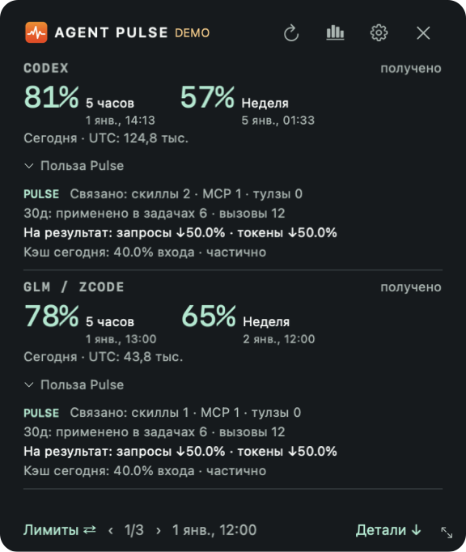

# Польза в виджете: что именно измеряется

[English](WIDGET_BENEFIT.md)

Под дневными счётчиками каждого клиента находится кнопка **«Польза Pulse»**. По умолчанию метрики свёрнуты. Нажмите, чтобы раскрыть или свернуть блок конкретного агента; высота окна подстроится. Выбор раскрытых блоков действует до перезапуска приложения. Верхняя монохромная панель и маленькая полоса квот Windows сохраняют прежний вид. Полное обновление данных обычно происходит раз в пять минут; можно обновить вручную.

- **Связано: скиллы / MCP / тулзы** — уникальные зарегистрированные инструменты с явной связью с проверенной находкой Pulse. Несколько версий считаются одним инструментом. Это весь реестр, а не число созданных сегодня инструментов. Регистрация не доказывает, что инструмент создал Pulse.
- **30д: применено в задачах / вызовы** — вручную отмеченное применение в выбранных задачах, связанных с этими версиями, и наблюдаемые штатные вызовы инструментов за сохранённые 30 дней. Это разные измерения. Чтение файла навыка и просмотр списка MCP не считаются вызовами. Нулевое число наблюдений не доказывает отсутствие использования.
- **Модель: запросы / токены** — изменение расхода на принятый результат в одной явно выбранной паре. Откройте **Аналитика → Сравнение**, выберите клиента, метку задачи и варианты «до»/«после», затем **Закрепить пару в виджете**. Там же можно сбросить выбор. Pulse не подбирает наиболее выгодный процент. Нужны хотя бы три задачи на вариант, полные штатные счётчики, сопоставимые наблюдаемые группы и проверенное качество. Условия те же, что у подробного сравнения. Расход выбранных неудачных попыток и доработок также учитывается. Стрелка вниз означает снижение расхода, вверх — рост. Ноль отличается от неизвестного значения. Это разница наблюдений, а не доказательство причинного эффекта Pulse: сложность задач и настройки модели проверяет человек.
- **Кэш сегодня** — доля локального входа из кэша за текущий день UTC, с частичным охватом. Этот показатель отделён от сравнения задач и не приписывается Pulse. Если счётчики кэша или запросов модели не переданы, отображается прочерк.

Нажатие на раскрытые метрики открывает аналитику. На macOS подсказка показывает выбранную метку, варианты, размеры выборок и ограничения. Универсальный «процент продуктивности», экономия подписки и денег не рассчитываются. Вызовы инструментов не заменяют счётчики запросов модели.

Выбор пары сохраняется в существующем локальном журнале (`widget_comparison`): одна короткая метка и два варианта на клиента. После перезапуска выбор остаётся; переписка, промпты и содержимое инструментов не сохраняются. Для пересчёта используются все сохранённые проверенные задачи, а не только первые 100 строк отчёта. При истечении срока хранения или нехватке данных процент становится недоступным, а не остаётся устаревшим.

Локальные команды для закрепления и сброса приведены в [английской инструкции](WIDGET_BENEFIT.md). Сброс выбора не меняет задачи, находки и инструменты.

